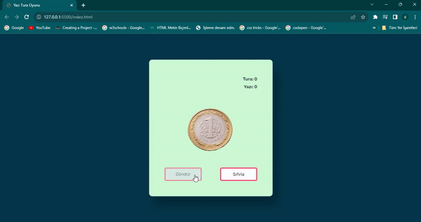

Yazı Tura Oyunu
Bu proje, tarayıcı üzerinde çalışan basit bir yazı tura oyununu içerir. Oyun, kullanıcının bir para atışı yapmasına olanak tanır ve sonucu gösterir.

Kullanım
Oyunu oynamak için aşağıdaki adımları izleyin:

Projeyi bilgisayarınıza klonlayın veya ZIP dosyasını indirip çıkarın.

index.html dosyasını bir web tarayıcısında açın.

Tarayıcıda açılan sayfada, "Yazı" veya "Tura" düğmelerinden birini tıklayarak para atışı yapın.

Para atışının sonucunu görüntülemek için alttaki sonuç bölümünü kontrol edin.

Özellikler
Kullanıcı dostu arayüz: Basit ve kullanımı kolay bir arayüz sunar.
Rastgele sonuç: Her atışta rastgele sonuç üretir.
Sonuç gösterme: Kullanıcıya sonucu açıkça gösterir.
Teknolojiler
Bu proje aşağıdaki teknolojileri kullanır:

HTML5: Sayfa yapısı oluşturmak için kullanılır.
CSS3: Stil ve düzen eklemek için kullanılır.
JavaScript: Oyun mantığını uygulamak için kullanılır.
Katkıda Bulunma
Bu projeyi forklayın (sağ üst köşede bulunan "Fork" düğmesi).
Kendi değişikliklerinizi yapın ve geliştirmelerinizi ekleyin.
Değişikliklerinizi bir dal (branch) oluşturarak kaydedin (git checkout -b feature/yeni-ozellik).
Değişikliklerinizi commit edin (git commit -m 'Yeni özellik eklendi').
Değişikliklerinizi kendi fork'unuza push edin (git push origin feature/yeni-ozellik).
Bir pull isteği (pull request) oluşturun.
Lisans
Bu proje MIT Lisansı altında lisanslanmıştır. Daha fazla bilgi için LICENSE dosyasına göz atın.

Bu README dosyası, projenizi anlatmak ve kullanıcıların projeyi nasıl kullanacaklarını anlamalarına yardımcı olmak için kullanılabilir. Ayrıca, projenizin katkıda bulunmaya açık olduğunu ve diğer geliştiricilerin de projeye katkı sağlayabileceğini belirtmek için katkıda bulunma bölümünü içerir. Bu README dosyasını projenizin kök dizininde bulundurarak, projenizi daha erişilebilir ve anlaşılır hale getirebilirsiniz.

